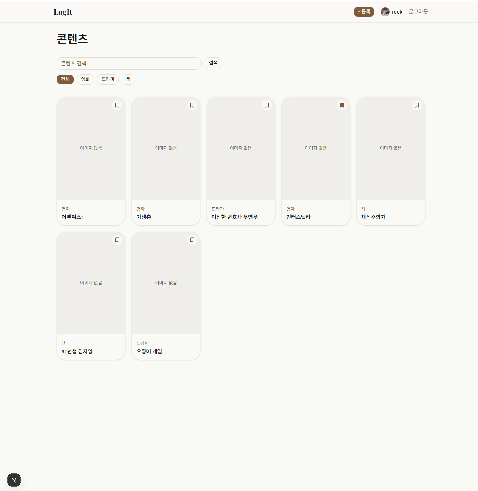
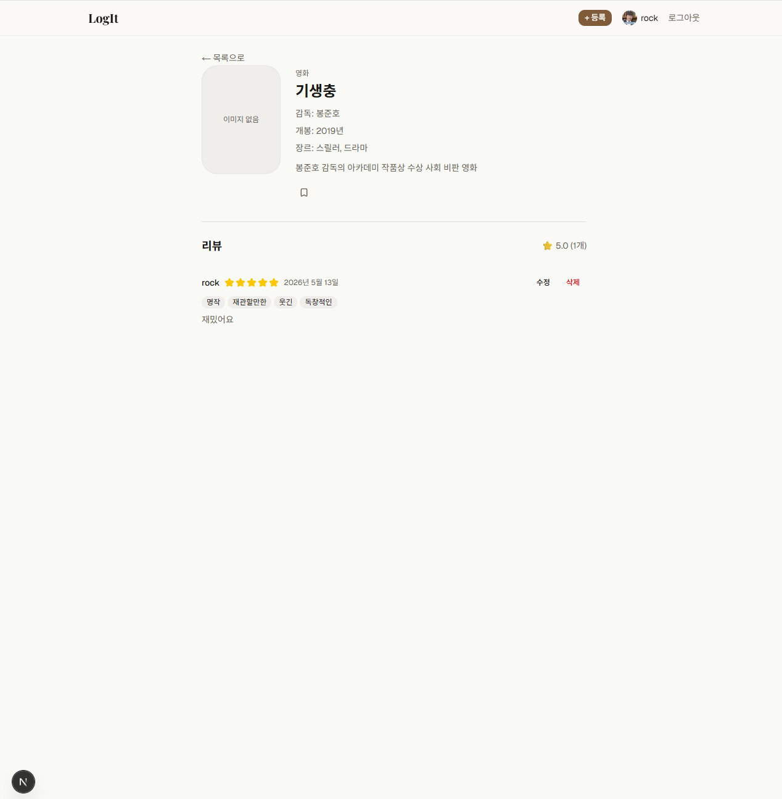
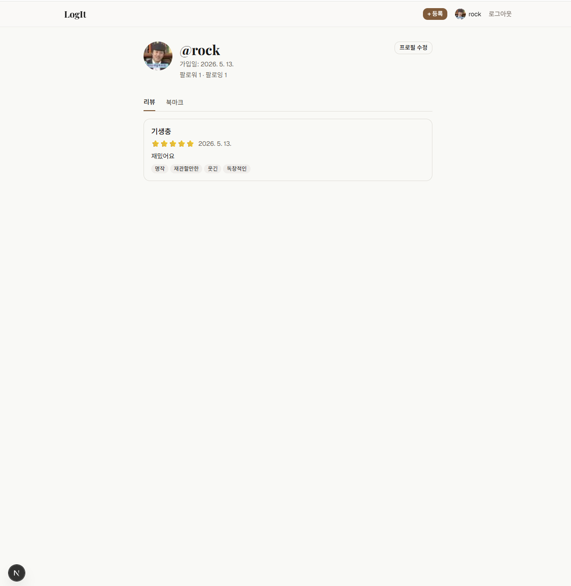
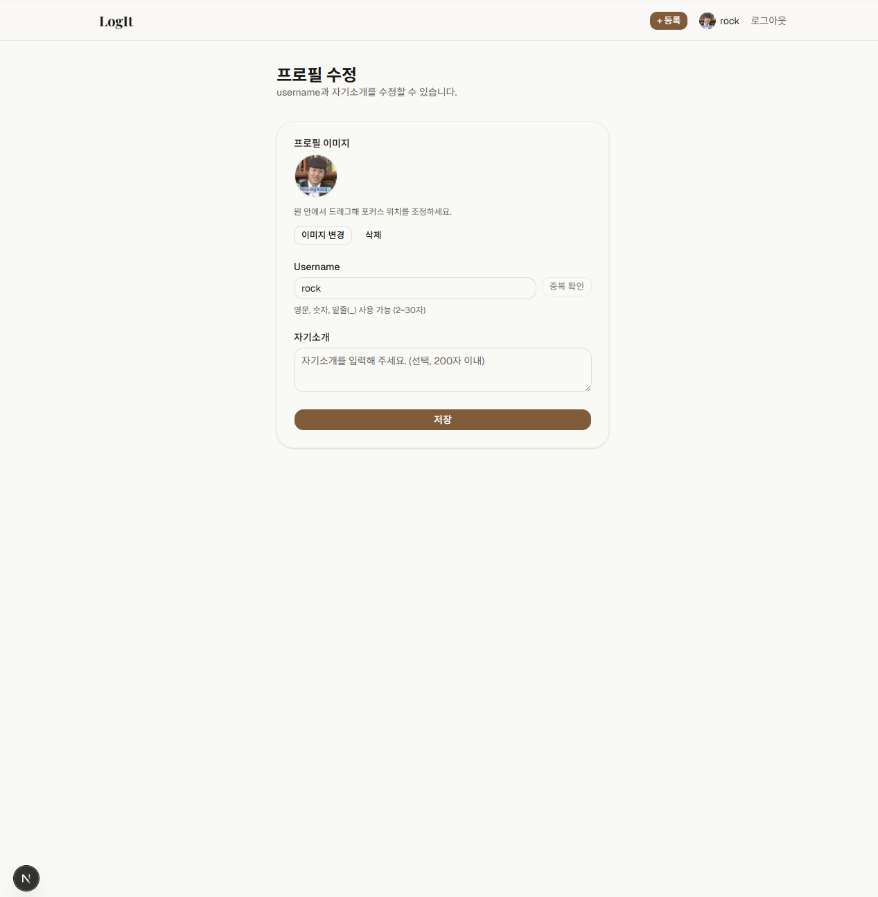

# LogIt

> 영화, 드라마, 책을 기록하고 리뷰를 공유하는 콘텐츠 로그 플랫폼


---

## 프로젝트 소개

**LogIt**은 본 영화, 드라마, 읽은 책을 한 곳에 기록하고 리뷰를 공유하는 SNS형 플랫폼입니다.  
별점과 프리셋 태그로 빠르게 감상을 남기고, 취향이 비슷한 유저를 팔로우해 새로운 콘텐츠를 발견할 수 있습니다.

| | |
|---|---|
| **개발 기간** | 2026-05-12 ~ 2026-05-15 |
| **개발 방식** | AI 활용 바이브 코딩 (기획 및 설계 방향 직접 결정) |
| **스택** | Next.js 16 App Router · Supabase Cloud · TypeScript · Tailwind v4 |

---

## 스크린샷

### 홈 — 콘텐츠 목록


### 콘텐츠 상세 + 리뷰


### 프로필 페이지


### 프로필 수정 — 아바타 업로드


> 📁 스크린샷은 `docs/screenshots/` 폴더에 추가하세요.

---

## 주요 기능

### 📼 콘텐츠 관리
- 영화 / 드라마 / 책 3가지 타입 등록 및 관리
- 타입별 메타데이터 구조화 (감독, 개봉연도, 장르 / 에피소드 수 / 저자, 출판사)
- 커버 이미지 직접 업로드 (Supabase Storage)
- 제목 검색 + 타입별 필터

### ⭐ 리뷰 시스템
- 별점(1~5점) + 프리셋 태그 + 자유 본문
- 콘텐츠당 1인 1리뷰 제한 (DB UNIQUE 제약)
- 평균 별점 실시간 표시
- 긴 리뷰는 더보기/축약 토글

### 🔖 북마크
- 콘텐츠 목록 카드와 상세 페이지 양쪽에서 즉시 저장
- **Optimistic UI** — 클릭 즉시 상태 전환, 실패 시 자동 롤백
- 내 프로필 북마크 탭에서 저장 목록 확인

### 👤 프로필
- username · bio · 아바타 이미지 설정
- 아바타 업로드 후 드래그로 focal point 조정 (라이브러리 없이 구현)
- 팔로워 / 팔로잉 수 표시

### 🤝 팔로우
- 프로필 페이지 + **콘텐츠 상세 작성자 영역**에서 팔로우/언팔로우
- Optimistic UI 토글
- 자기 자신 팔로우 방지 (서버 액션 + DB CHECK 이중 보호)

### 🔐 인증
- 이메일/패스워드 회원가입 · 로그인
- Google OAuth 소셜 로그인
- 비밀번호 재설정 (이메일 링크)
- 로그인 상태 기반 라우트 보호 (Next.js Middleware)

---

## 기술 스택

### Frontend

| 기술 | 선택 이유 |
|------|-----------|
| **Next.js 16 App Router** | Server Component 우선 렌더링으로 데이터 패칭 최적화. Streaming·Suspense로 콘텐츠와 리뷰를 분리 로딩 |
| **TypeScript** | Supabase 생성 타입과 연동해 DB 스키마 변경이 컴파일 오류로 즉시 감지 |
| **Tailwind CSS v4** | CSS 변수 기반 디자인 토큰으로 컬러 팔레트 일괄 관리 |
| **shadcn/ui (base-ui)** | 접근성이 내장된 헤드리스 컴포넌트. 디자인 커스텀 자유도 높음 |
| **React 19 `useOptimistic`** | 라이브러리 없이 북마크·팔로우 즉각 반응 구현 |

### Backend

| 기술 | 선택 이유 |
|------|-----------|
| **Supabase Cloud** | DB · Auth · Storage · RLS를 단일 서비스로 제공. 별도 API 서버 불필요 |
| **Next.js Server Actions** | 클라이언트-서버 경계를 명시적으로 관리. REST API 엔드포인트 없이 타입 안전한 서버 함수 호출 |
| **Row Level Security** | DB 수준에서 보안 강제. 프론트 우회 시도를 원천 차단 |

---

## 아키텍처 개요

```
┌─────────────────────────────────────────┐
│              Next.js App Router          │
│                                          │
│  Server Component ──fetch──▶ Supabase DB │
│        │                                 │
│        ▼                                 │
│  Client Component                        │
│        │                                 │
│        ▼ (mutation)                      │
│  Server Action ──write──▶ Supabase DB    │
│        │                                 │
│        └──── revalidatePath ────────────▶│
└─────────────────────────────────────────┘
```

**단방향 데이터 흐름**
1. Server Component가 Supabase에서 데이터 조회
2. Client Component에서 사용자 인터랙션 처리
3. Server Action으로 DB 변경 (RLS가 소유권 강제)
4. `revalidatePath`로 캐시 무효화 → 서버 컴포넌트 재실행

---

## 프로젝트 구조

```
agent_project/
├── frontend/                  # Next.js 앱
│   ├── app/
│   │   ├── (auth)/            # 로그인·회원가입 등 비인증 라우트
│   │   ├── (main)/            # 인증 필수 라우트
│   │   │   ├── _components/   # 공유 컴포넌트 (Header, Avatar, BookmarkButton, FollowButton...)
│   │   │   ├── contents/      # 콘텐츠 도메인 페이지
│   │   │   └── profile/       # 유저/프로필 도메인 페이지
│   │   └── auth/callback/     # OAuth 콜백 Route Handler
│   ├── actions/               # Server Actions (auth, contents, reviews, bookmarks, user)
│   ├── components/ui/         # shadcn/ui 컴포넌트
│   ├── lib/supabase/          # Supabase 클라이언트 (server, client, middleware)
│   └── types/                 # TypeScript 타입 (database.ts, content.ts)
├── backend/
│   └── supabase/migrations/   # DB 마이그레이션 SQL
└── docs/                      # 프로젝트 문서
    ├── PROJECT-OVERVIEW.md    # 기획안 + 설계 결정 기록
    ├── DOMAIN-*.md            # 도메인별 원칙·규칙 문서
    └── AI-ACTION-LOGS.md      # 구현 이력
```

---

## DB 스키마

```
contents          profiles
───────           ────────
id (PK)           id (PK) = auth.users.id
type              username (UNIQUE)
title             avatar_url
metadata(jsonb)   avatar_position(jsonb)
cover_image_url   bio
created_by(FK) ──▶ is_profile_setup
                  ◀── reviews.user_id
reviews           ◀── bookmarks.user_id
───────           ◀── follows.follower_id
id (PK)           ◀── follows.following_id
user_id(FK)
content_id(FK)    follows           bookmarks
rating            ───────           ─────────
body              follower_id(FK)   user_id(FK)
tags[]            following_id(FK)  content_id(FK)
UNIQUE(user_id, content_id)         UNIQUE(user_id, content_id)
```

> 전 테이블 RLS 활성화. `covers` · `avatars` Storage 버킷은 public read, 본인만 write.

---

## 시작하기

### 사전 요구사항
- Node.js 18+
- Supabase CLI
- Supabase Cloud 프로젝트

### 설치

```bash
# 저장소 클론
git clone <repo-url>
cd agent_project/frontend

# 의존성 설치
npm install

# 환경변수 설정
cp .env.example .env.local
# .env.local에 Supabase URL, Publishable Key, Site URL 입력
```

### DB 마이그레이션

```bash
cd ../backend
supabase login
supabase link --project-ref <your-project-ref>
supabase db push
```

### 개발 서버 실행

```bash
cd ../frontend
npm run dev
# http://localhost:3000
```

---

## 설계 결정 하이라이트

> 기획/설계 단계에서 직접 내린 주요 결정들입니다. 상세 내용은 [`docs/PROJECT-OVERVIEW.md`](./docs/PROJECT-OVERVIEW.md)를 참고하세요.

**콘텐츠 타입을 3가지로 한정한 이유**  
영화·드라마·책은 함께 소비되는 경우가 많고 메타데이터 구조가 명확합니다. 타입을 늘리면 필터 UI와 메타데이터 관리 복잡도가 급격히 올라가므로 MVP에서는 완성도를 위해 한정했습니다.

**북마크를 목록 카드에도 배치한 이유**  
상세 페이지 진입 없이 목록에서 바로 저장할 수 있어야 마찰이 줄어듭니다. ContentCard가 북마크 로직을 직접 알지 않도록 render prop(슬롯) 방식으로 주입해 컴포넌트 분리도 유지했습니다.

**팔로우 버튼을 콘텐츠 상세 페이지에도 배치한 이유**  
"이 사람 리뷰 더 보고 싶다"는 맥락은 프로필 페이지보다 콘텐츠를 보는 순간에 생깁니다. 프로필로 이동하는 단계를 없애 팔로우 전환율을 높이는 방향으로 설계했습니다.

**Optimistic UI를 선택한 이유**  
북마크·팔로우처럼 빈번한 인터랙션은 서버 응답을 기다리는 딜레이가 UX를 해칩니다. React 19의 `useOptimistic`으로 라이브러리 없이 클릭 즉시 반응하고 실패 시 롤백하는 패턴을 구현했습니다.

---

## 문서

| 문서 | 내용 |
|------|------|
| [PROJECT-OVERVIEW.md](./docs/PROJECT-OVERVIEW.md) | 기획안, DB 설계, 설계 결정 기록 |
| [ARCHITECTURE-CONSTITUTION.md](./docs/ARCHITECTURE-CONSTITUTION.md) | 아키텍처 핵심 원칙 |
| [DOMAIN-*.md](./docs/) | 도메인별 원칙 및 구현 규칙 |
| [AI-ACTION-LOGS.md](./docs/AI-ACTION-LOGS.md) | 전체 구현 이력 |
